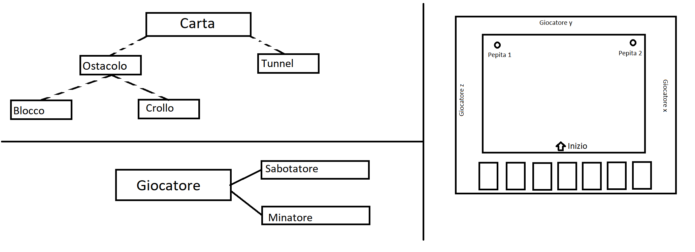

# QtMiner

##Carta
#disruttore
#
##Tunnel
	#coordinate(array? di booleani ordine N.E.S.O.)

	#getpath(virtuale): 
		si attiva all'inizio del turno
		evidenzia le celle verdi quelle in cui è possibile inserire 
			una carta

	##Percorso 
		//#getGemma: return true se nella carta è presente una gemma
		#getpath: ritorna tutte le vie possibili (dipendono da neso)
	
	##Blocco
		#getpath:return false;
		
##Crollo
	#getcella: si chiede se la cella selezionata è istanziata
			   non è utilizzabile su celle nulle

##Giocatore:
	#sabotatore: ha come obiettivo impedire il raggiungimento 
				 della pepita (getpath di board == null)
	#minatore: 	ha come obiettivo raggiungere la pepita (getpath
				raggiunge la pepita)
				

##Problemi riscontrati:
#getpath 
	1 funzione ritorna tutte le possibili celle
	2 Null (la board deve vedere !carta )
	3 Ricorsione non si ferma al primo risultato ma deve trovare tutte 
		le soluzioni
	4 getpath evitare di fare la ricorsione a celle da cui è arrivato
	5 evitare ricorrenza infinita (lunghezza ricorsione <= carte giocate)

##Idea: 
#tracking percorso su file
#istruzioni
